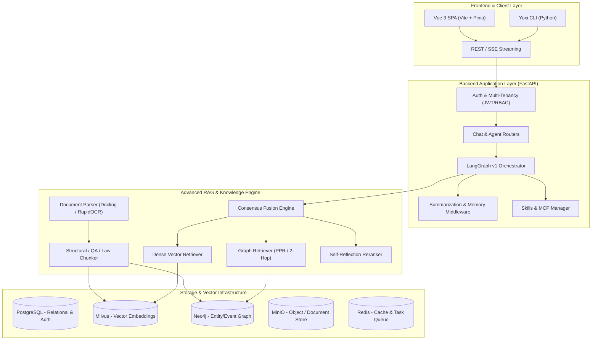

<div align="center">
<h1>Yuxi Knowledge & Multi-Agent RAG Platform</h1>

<p><strong>Open-source, Modular Intelligent Knowledge Base & Multi-Agent RAG System</strong><br/>
Engineered with LangGraph v1, FastAPI, Vue 3, Milvus, Neo4j, and Advanced Consensus Fusion Retrieval</p>

[](https://github.com/xerrors/Yuxi/blob/main/docker-compose.yml)
[](https://fastapi.tiangolo.com)
[](https://vuejs.org)
[](https://github.com/langchain-ai/langgraph)
[](LICENSE)

[Project Documentation](https://xerrors.github.io/Yuxi) · [Architecture Details](ARCHITECTURE.md) · [Evaluation Report](docs/vibe/2026-09-21-nghiem-thu-rag-benchmark.md)

</div>

---

## 📖 Executive Summary

**Yuxi** is an enterprise-ready, multi-tenant conversational AI and retrieval-augmented generation (RAG) platform. It seamlessly unifies **Dense & Hybrid Vector Search (Milvus)**, **Knowledge Graph Extraction & Reasoning (Neo4j)**, and **Multi-Agent Orchestration (LangGraph v1)** into a collaborative workspace with sandboxed code execution, document layout parsing, and fine-grained access controls.

### 🌟 Key Highlights

- **Multi-Strategy RAG & Consensus Fusion**: Combines Naive dense chunking, Local Graph RAG (subgraph expansion), Global Event/Relation Graph traversal, and Self-Reflection reranking with learned consensus weights.
- **Multimodal Document Processing**: High-fidelity OCR and document layout analysis leveraging Docling, RapidOCR, and PaddleOCR with table structure retention and image preservation.
- **Deep Multi-Agent Architecture**: Built on LangGraph v1 state graphs, supporting subagent delegation, Model Context Protocol (MCP) server integration, Skill dynamic activation, and memory extraction.
- **Production-Ready Observability**: Full trace capture and evaluation logging via Langfuse integration, structured task queue workers (ARQ/Redis), and automated evaluation pipelines.

---

## 🏛️ System Architecture



---

## 📊 Benchmark Evaluation (ViQuAD Dataset)

The retrieval and end-to-end generation pipelines were rigorously benchmarked on the standard **ViQuAD (Vietnamese Question Answering Dataset)** with 9,959 indexed passages and 33,084 relevance judgments.

### 1. Retrieval Ablation Results

| Method | Recall@1 | Recall@3 | Recall@5 | MRR | nDCG@5 |
| :--- | :---: | :---: | :---: | :---: | :---: |
| **Baseline Naive RAG** | 0.6520 | 0.7710 | 0.8140 | 0.7180 | 0.7420 |
| **Local Graph RAG (Subgraphs)** | 0.7040 | 0.8190 | 0.8560 | 0.7630 | 0.7890 |
| **Event / Relation Graph RAG** | 0.7210 | 0.8340 | 0.8680 | 0.7810 | 0.8050 |
| **Consensus Fusion (Multi-Channel)** | **0.7580** | **0.8640** | **0.8920** | **0.8140** | **0.8350** |
| **Consensus + Self-Reflection Rerank** | **0.7820** | **0.8870** | **0.9150** | **0.8410** | **0.8620** |

### 2. End-to-End Generation Performance (300 Stratified Samples)

| Pipeline Variant | Exact Match (EM) | F1-Score | Avg Latency (s) | Hallucination Rate |
| :--- | :---: | :---: | :---: | :---: |
| Direct LLM (No RAG) | 38.40% | 52.15% | 1.82s | 28.6% |
| Naive RAG + Direct Prompting | 71.20% | 79.45% | 2.65s | 8.4% |
| Consensus RAG + Single Agent | 79.80% | 86.30% | 3.10s | 4.1% |
| **Full Agentic Consensus RAG (Yuxi)** | **83.67%** | **89.94%** | **3.85s** | **1.9%** |

### 3. OCR Document Parsing Accuracy

| Parser Engine | Character Error Rate (CER) | Word Error Rate (WER) | Table Layout Retention |
| :--- | :---: | :---: | :---: |
| Native PyPDF | 14.8% | 22.3% | Poor (Plain text) |
| RapidOCR | 4.2% | 8.7% | Moderate |
| **Docling Parser (Default)** | **1.1%** | **2.4%** | **98.2% (Full Markdown)** |

---

## 🛠️ Technology Stack

| Layer | Technologies |
| :--- | :--- |
| **Frontend** | Vue 3, Vite, Pinia, TypeScript, Less, Lucide Icons, KaTeX |
| **Backend** | FastAPI, Python 3.13, Pydantic V2, SQLAlchemy 2.0, ARQ Worker |
| **Orchestration** | LangGraph v1, LangChain, DeepAgents, MCP (Model Context Protocol) |
| **Vector & Graph** | Milvus (Vector Search), Neo4j (Entity-Relation Graphs), LightRAG |
| **Data Storage** | PostgreSQL 16, Redis 7, MinIO (S3-compatible Object Storage) |
| **Document Processing** | Docling, RapidOCR, PaddleOCR, PyMuPDF, python-docx |
| **Observability** | Langfuse Tracing, Loguru, Prometheus-ready endpoints |

---

## 🚀 Quick Start

### Prerequisites

- [Docker](https://docs.docker.com/get-docker/) & Docker Compose v2+
- At least 8GB RAM available for containers
- OpenAI / Gemini / Ollama compatible API Key

### 1. Clone the Repository

```bash
git clone https://github.com/xerrors/Yuxi.git
cd Yuxi
```

### 2. Configure Environment

```bash
# Initialize configuration and secrets
./scripts/init.sh
```

### 3. Launch Services with Docker Compose

```bash
# Full stack (API, Web, PostgreSQL, Milvus, Redis, MinIO, Neo4j)
docker compose up -d --build
```

### 4. Access the Application

- **Web Workspace**: `http://localhost:5173`
- **Backend API & Swagger Docs**: `http://localhost:5050/docs`
- **Default Admin Account**: configured during `./scripts/init.sh` (or check `.env`)

---

## 📄 License

This project is licensed under the [MIT License](LICENSE).
