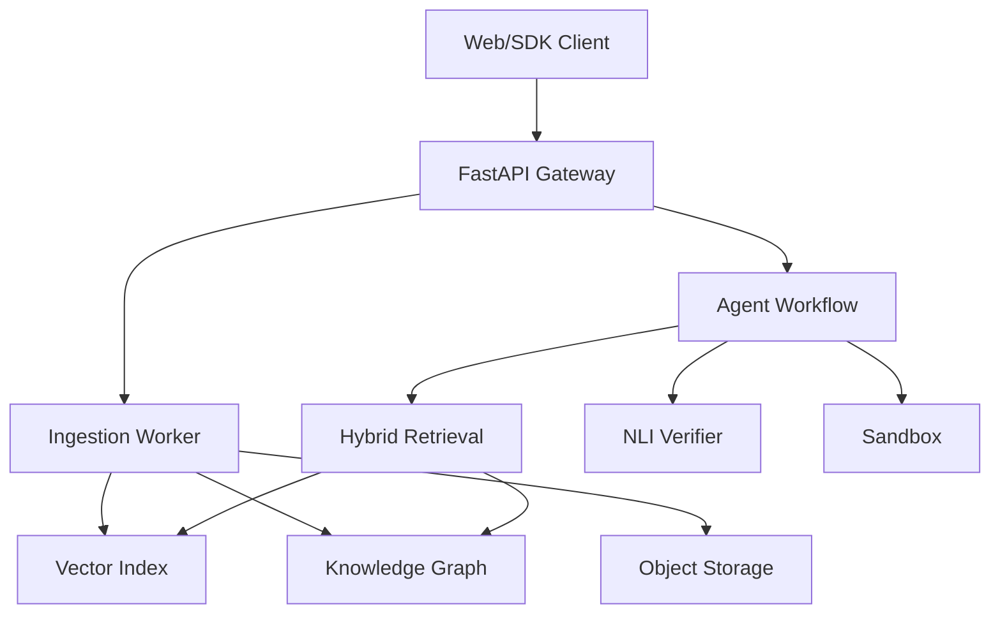

TRƯỜNG [TÊN TRƯỜNG]

KHOA/VIỆN [TÊN KHOA HOẶC VIỆN]

---

[HỌ VÀ TÊN SINH VIÊN]

NGHIÊN CỨU, THIẾT KẾ VÀ PHÁT TRIỂN NỀN TẢNG HỎI–ĐÁP THÔNG MINH VÀ HỆ TÁC TỬ TRI THỨC ĐA PHƯƠNG THỨC TRÊN NGỮ LIỆU TIẾNG VIỆT

YUXI AGENTIC MULTIMODAL RAG PLATFORM

ĐỒ ÁN TỐT NGHIỆP/KHÓA LUẬN TỐT NGHIỆP  

Ngành: [TÊN NGÀNH]  

Mã ngành: [MÃ NGÀNH]

Giảng viên hướng dẫn: [HỌ VÀ TÊN]  

Sinh viên thực hiện: [HỌ VÀ TÊN]  

Mã số sinh viên: [MSSV]  

Lớp: [LỚP]

[ĐỊA ĐIỂM], [NĂM]

---

# LỜI CAM ĐOAN

Tôi cam đoan đồ án này là kết quả nghiên cứu và triển khai của cá nhân tôi dưới sự hướng dẫn của [HỌ VÀ TÊN GIẢNG VIÊN]. Các nội dung tham khảo đều được trích dẫn và ghi nguồn đầy đủ. Các số liệu, kết quả thực nghiệm và kết luận trình bày trong đồ án là trung thực, có thể truy nguyên về cấu hình, mã nguồn và tệp kết quả thực nghiệm tương ứng. Tôi hoàn toàn chịu trách nhiệm về nội dung của đồ án.

[ĐỊA ĐIỂM], ngày ... tháng ... năm ...  

Sinh viên thực hiện  

[KÝ VÀ GHI RÕ HỌ TÊN]

# LỜI CẢM ƠN

Tôi xin trân trọng cảm ơn giảng viên hướng dẫn đã dành thời gian góp ý về định hướng nghiên cứu, phương pháp thực nghiệm và cách trình bày kết quả trong suốt quá trình thực hiện đồ án. Những nhận xét chuyên môn và yêu cầu về tính trung thực của số liệu là cơ sở quan trọng để tôi hoàn thiện hệ thống cũng như báo cáo này.

Tôi cũng xin cảm ơn các thầy cô trong khoa, bạn bè và những người đã hỗ trợ tôi trong quá trình học tập, kiểm thử hệ thống và rà soát tài liệu. Các bộ dữ liệu, mô hình và phần mềm nguồn mở được cộng đồng công bố đã tạo điều kiện để đồ án có thể triển khai và đánh giá theo hướng có khả năng tái lập.

Mặc dù đã nỗ lực kiểm tra nội dung và kết quả thực nghiệm, báo cáo khó tránh khỏi thiếu sót. Tôi mong nhận được các ý kiến đóng góp để tiếp tục cải thiện nghiên cứu và hệ thống trong tương lai.

# TÓM TẮT

Các mô hình ngôn ngữ lớn có khả năng sinh văn bản tự nhiên nhưng còn hạn chế khi xử lý tri thức chuyên biệt, dữ liệu nội bộ và thông tin cần đối chiếu nguồn. Đồ án nghiên cứu và phát triển Yuxi, một nền tảng hỏi–đáp tăng cường truy xuất trên ngữ liệu tiếng Việt. Nền tảng triển khai các thành phần truy xuất từ khóa, truy xuất vector, điều phối tác tử và kiểm chứng bằng suy luận ngôn ngữ tự nhiên trên kiến trúc FastAPI, LangGraph, Milvus, Neo4j cùng các dịch vụ hỗ trợ trong Docker Compose. Trong phạm vi thực nghiệm, đồ án đánh giá trực tiếp truy xuất từ khóa và vector, RAG đầu cuối, gọi công cụ, NLI và một pilot OCR tài liệu in; truy xuất đồ thị, tái xếp hạng và OCR trên tài liệu doanh nghiệp chưa có kết quả định lượng hoàn chỉnh.

Đồ án xây dựng quy trình đánh giá theo từng tầng và lưu tệp kết quả (artifact) để truy nguyên. Trên 2.048 truy vấn VieQuAD, phương pháp từ khóa của Yuxi đạt Recall@10 92,38% và MRR@10 0,7239; trong khi cấu hình truy xuất vector được khảo sát đạt lần lượt 16,65% và 0,0861. Trên 150 câu hỏi UIT-ViQuAD 2.0, RAG tiêu chuẩn đạt EM 45,33% và F1 66,94%; ablation single-evidence với Qwen2.5 7B đạt EM 34,67% và F1 47,36%, precision từ chối 43,75% và recall từ chối 70,00%. Thử nghiệm gọi công cụ đạt 98% độ chính xác chọn công cụ và 93% khớp chính xác toàn bộ lời gọi trên 100 tác vụ. Bộ kiểm chứng NLI trên 2.091 cặp ViWikiFC đạt độ chính xác 56,77% và macro F1 51,54% ở cấu hình vận hành. OCR pilot trên 40 trang printed-document đạt CER 24,40% trên 30 trang MeddiesOCR và 22,87% trên 10 trang VietAge-OCR. Kết quả cho thấy truy xuất từ khóa vẫn là thành phần hiệu quả nhất trên tập dữ liệu được khảo sát, đồng thời chất lượng sinh câu trả lời, quyết định gọi công cụ và kiểm chứng mệnh đề vẫn còn dư địa cải thiện. OCR pilot chỉ có tính thăm dò; Meddies ground truth chưa được phép tái phân phối và chưa đại diện cho tài liệu doanh nghiệp hiện đại.

Từ khóa: truy xuất tăng cường tạo sinh, RAG, tác tử trí tuệ nhân tạo, truy xuất thông tin, đồ thị tri thức, OCR, NLI, tiếng Việt.

# ABSTRACT

Large language models can generate fluent natural-language responses but remain limited when handling domain-specific knowledge, private data, and claims that require source verification. This thesis presents Yuxi, a retrieval-augmented question-answering platform for Vietnamese documents, including text, PDF, and image inputs. The platform implements lexical and dense retrieval, knowledge-graph components, reranking, agent orchestration, and natural-language-inference-based verification. The completed experiments directly evaluate lexical and dense retrieval, end-to-end RAG, tool use, NLI, and a printed-document OCR pilot; graph retrieval, reranking, and broad enterprise-document OCR remain outside the completed quantitative evaluation.

The thesis adopts a layered evaluation protocol with traceable artifacts. On 2,048 VieQuAD queries, Yuxi's lexical retriever achieved 92.38% Recall@10 and 0.7239 MRR@10, whereas the evaluated dense configuration achieved 16.65% and 0.0861, respectively. On 150 UIT-ViQuAD 2.0 questions, standard RAG obtained 45.33% exact match and 66.94% token F1; a single-evidence Qwen2.5 7B ablation obtained 34.67% and 47.36%, with 43.75% abstention precision and 70.00% abstention recall. Tool-use evaluation reached 98% tool-selection accuracy and 93% exact-call accuracy over 100 tasks. On 2,091 ViWikiFC claim–evidence pairs, the operational NLI configuration achieved 56.77% accuracy and 51.54% macro F1. A 40-page printed-document OCR pilot obtained 24.40% CER on 30 MeddiesOCR pages and 22.87% CER on 10 VietAge-OCR pages. These OCR results are exploratory; Meddies ground truth is restricted to internal use because its annotation license is undeclared. These results indicate that lexical retrieval remained the strongest retrieval component on the evaluated corpus, while answer generation, tool-use decisions, claim verification, and robust document OCR still require improvement. The causal effect of the NLI gate on end-to-end RAG was outside the completed experimental scope.

Keywords: retrieval-augmented generation, RAG, AI agent, information retrieval, knowledge graph, OCR, natural language inference, Vietnamese.

# MỤC LỤC

- Lời cam đoan
- Lời cảm ơn
- Tóm tắt
- Abstract
- Danh mục từ viết tắt, hình và bảng
- Chương 1. Tổng quan đề tài
  - 1.1. Bối cảnh nghiên cứu
  - 1.2. Phát biểu bài toán
  - 1.3. Mục tiêu nghiên cứu
  - 1.4. Câu hỏi nghiên cứu
  - 1.5. Phạm vi nghiên cứu
  - 1.6. Đóng góp của đồ án
  - 1.7. Bố cục luận văn
- Chương 2. Cơ sở lý thuyết và công trình liên quan
  - 2.1. Mô hình ngôn ngữ lớn và hệ tác tử
  - 2.2. Retrieval-Augmented Generation
  - 2.3. Truy xuất từ khóa bằng BM25
  - 2.4. Truy xuất vector và HNSW
  - 2.5. Hybrid retrieval và dung hợp thứ hạng
  - 2.6. Đồ thị tri thức và Personalized PageRank
  - 2.7. Tái xếp hạng
  - 2.8. NLI và kiểm chứng bám nguồn
  - 2.9. Công trình liên quan
- Chương 3. Phương pháp và thiết kế hệ thống
  - 3.1. Yêu cầu hệ thống
  - 3.2. Kiến trúc tổng thể
  - 3.3. Pipeline tiếp nhận tài liệu
  - 3.4. Xây dựng đồ thị tri thức
  - 3.5. Dung hợp kết quả truy xuất
  - 3.6. Workflow tác tử
  - 3.7. NLI verifier và self-correction
  - 3.8. An toàn và quan sát hệ thống
- Chương 4. Thiết kế thực nghiệm và kết quả
  - 4.1. Nguyên tắc đánh giá
  - 4.2. Bộ dữ liệu và cách chia tập
  - 4.3. Danh mục thí nghiệm
  - 4.4. Chỉ số đánh giá
  - 4.5. Giao thức thực nghiệm
  - 4.6. So sánh phương pháp truy xuất
  - 4.7. Tìm trọng số dung hợp
  - 4.8. Đánh giá đầu cuối
  - 4.9. Phạm vi đánh giá OCR
  - 4.10. Đánh giá tác tử
  - 4.11. Đánh giá NLI
  - 4.12. Độ trễ và chi phí
  - 4.13. Phân tích lỗi
  - 4.14. Đe dọa đối với tính hợp lệ
- Chương 5. Kết luận và hướng phát triển
  - 5.1. Kết luận
  - 5.2. Hạn chế
  - 5.3. Hướng phát triển
- Tài liệu tham khảo
- Phụ lục A. Ma trận truy nguyên kết quả
- Phụ lục B. Cấu hình hệ thống
- Phụ lục C. Artifact index

# DANH MỤC TỪ VIẾT TẮT

| Viết tắt | Thuật ngữ tiếng Anh | Ý nghĩa tiếng Việt |
| --- | --- | --- |
| API | Application Programming Interface | Giao diện lập trình ứng dụng |
| BM25 | Best Matching 25 | Thuật toán xếp hạng từ khóa |
| CER | Character Error Rate | Tỷ lệ lỗi ký tự |
| EM | Exact Match | Độ khớp chính xác |
| HNSW | Hierarchical Navigable Small World | Cấu trúc chỉ mục vector xấp xỉ |
| KG | Knowledge Graph | Đồ thị tri thức |
| LLM | Large Language Model | Mô hình ngôn ngữ lớn |
| MRR | Mean Reciprocal Rank | Trung bình nghịch đảo thứ hạng |
| nDCG | Normalized Discounted Cumulative Gain | Độ lợi tích lũy chiết khấu chuẩn hóa |
| NLI | Natural Language Inference | Suy luận ngôn ngữ tự nhiên |
| OCR | Optical Character Recognition | Nhận dạng ký tự quang học |
| PPR | Personalized PageRank | PageRank cá nhân hóa |
| RAG | Retrieval-Augmented Generation | Sinh tăng cường truy xuất |
| RRF | Reciprocal Rank Fusion | Dung hợp theo nghịch đảo thứ hạng |
| TTFT | Time to First Token | Thời gian tới token đầu tiên |
| WER | Word Error Rate | Tỷ lệ lỗi từ |

# DANH MỤC HÌNH

- Hình 3.1. Kiến trúc tổng thể của nền tảng Yuxi.

# DANH MỤC BẢNG

- Bảng 1.1. Mục tiêu nghiên cứu và thí nghiệm đối chứng.
- Bảng 2.1. So sánh các nhóm công trình liên quan.
- Bảng 3.1. Thành phần công nghệ của hệ thống.
- Bảng 3.2. Chính sách xử lý kết quả NLI.
- Bảng 4.1. Danh mục thí nghiệm.
- Bảng 4.2. Kết quả so sánh phương pháp truy xuất.
- Bảng 4.3. Kết quả tìm trọng số dung hợp.
- Bảng 4.4. Kết quả đánh giá RAG đầu cuối.
- Bảng 4.5. Kết quả đánh giá tác tử.
- Bảng 4.6. Ma trận nhầm lẫn NLI của cấu hình vận hành.
- Bảng 4.7. Ma trận nhầm lẫn NLI của cấu hình tiêu chuẩn.
- Bảng 4.8. Chỉ số đánh giá NLI.
- Bảng 4.9. Độ trễ các thành phần.
- Bảng 4.10. Phân tích lỗi tác tử.
- Bảng 4.11. Kết quả pilot OCR tài liệu in.

# CHƯƠNG 1. TỔNG QUAN ĐỀ TÀI

## 1.1. Bối cảnh nghiên cứu

Mô hình ngôn ngữ lớn đã đạt được nhiều tiến bộ trong hiểu và sinh ngôn ngữ tự nhiên. Tuy nhiên, khi được triển khai trong các hệ thống hỏi–đáp chuyên ngành, mô hình vẫn đối mặt với ba hạn chế chính. Thứ nhất, mô hình có thể tạo ra nội dung nghe hợp lý nhưng không được hỗ trợ bởi nguồn dữ liệu, thường được gọi là hiện tượng ảo giác. Thứ hai, tri thức trong tham số mô hình không bảo đảm cập nhật và không bao gồm dữ liệu nội bộ của tổ chức. Thứ ba, việc đưa toàn bộ tài liệu vào cửa sổ ngữ cảnh làm tăng chi phí, độ trễ và nguy cơ bỏ sót thông tin quan trọng.

Retrieval-Augmented Generation (RAG) giải quyết một phần các hạn chế trên bằng cách truy xuất các đoạn thông tin liên quan trước khi yêu cầu mô hình sinh câu trả lời. Tuy vậy, một pipeline chỉ sử dụng phân đoạn cố định và tìm kiếm vector thường gặp khó khăn với truy vấn chứa mã hiệu, thuật ngữ hiếm, quan hệ nhiều bước, bảng biểu hoặc tài liệu quét. Đối với tiếng Việt, tách từ, từ ghép, dấu thanh, cách viết tên riêng và cấu trúc văn bản hành chính làm tăng thêm độ khó cho cả truy xuất từ khóa và đánh giá câu trả lời.

Từ bối cảnh đó, đồ án tập trung nghiên cứu Yuxi, một nền tảng RAG có điều phối tác tử, kết hợp nhiều tín hiệu truy xuất và có tầng kiểm chứng câu trả lời. Trọng tâm của nghiên cứu không chỉ là xây dựng hệ thống hoạt động được mà còn là thiết lập một quy trình đánh giá có thể tái lập và phản ánh đúng giới hạn của hệ thống.

## 1.2. Phát biểu bài toán

Cho tập tài liệu tiếng Việt $D=\{d_1,d_2,\ldots,d_n\}$ và câu hỏi người dùng $q$, hệ thống cần:

- trích xuất và chuẩn hóa nội dung từ tài liệu văn bản, PDF hoặc ảnh;
- truy xuất tập chứng cứ $C_q\subset D$ có liên quan đến câu hỏi;
- sinh câu trả lời $a$ dựa trên chứng cứ đã truy xuất;
- cung cấp trích dẫn có thể kiểm tra;
- từ chối hoặc cảnh báo khi chứng cứ không đủ; và
- kiểm soát độ trễ, chi phí cùng lỗi gọi công cụ trong giới hạn vận hành xác định.

Đồ án không xem một câu trả lời trôi chảy là đủ. Câu trả lời cần vừa phù hợp với câu hỏi, vừa được hỗ trợ bởi tài liệu nguồn và được tạo ra bằng một quy trình có thể quan sát, đo lường và tái lập.

## 1.3. Mục tiêu nghiên cứu

### 1.3.1. Mục tiêu tổng quát

Thiết kế, triển khai và đánh giá một nền tảng hỏi–đáp RAG trên ngữ liệu tiếng Việt, hỗ trợ tài liệu đa định dạng, truy xuất kết hợp, điều phối tác tử và kiểm chứng mức độ bám nguồn.

### 1.3.2. Mục tiêu cụ thể

*Bảng 1.1. Mục tiêu nghiên cứu và thí nghiệm đối chứng.*

| Mã | Mục tiêu | Thí nghiệm đối chứng |
| --- | --- | --- |
| O1 | Thiết kế pipeline tiếp nhận, trích xuất và phân đoạn tài liệu | Chương 3; OCR định lượng được nêu trong giới hạn nghiên cứu |
| O2 | So sánh BM25, truy xuất vector, dung hợp có trọng số và RRF | EXP-RET-01 |
| O3 | Xác định trọng số dung hợp trên tập hiệu chỉnh độc lập | EXP-RET-02 |
| O4 | Đánh giá chất lượng trả lời đầu cuối và khả năng từ chối | EXP-E2E-01 |
| O5 | Đánh giá lựa chọn công cụ, đối số và quyết định có gọi công cụ | EXP-AGT-01 |
| O6 | Đánh giá khả năng phát hiện mệnh đề không được hỗ trợ | EXP-NLI-01 |
| O7 | Định lượng độ trễ của các thành phần đã có log thực nghiệm | EXP-SYS-01 |

## 1.4. Câu hỏi nghiên cứu

RQ1: Truy xuất từ khóa, truy xuất vector và các phương pháp dung hợp khác nhau như thế nào về Recall@K, MRR và nDCG@K trên VieQuAD?

RQ2: RAG tiêu chuẩn cải thiện EM, F1 và khả năng từ chối như thế nào so với baseline trích xuất; đồng thời bộ kiểm chứng NLI phân loại quan hệ mệnh đề–chứng cứ với độ chính xác nào?

RQ3: Tác tử lựa chọn công cụ, truyền đối số và quyết định có cần gọi công cụ với độ chính xác như thế nào trên bộ tác vụ có nhãn chuẩn?

RQ4: Độ trễ của truy xuất, sinh câu trả lời và NLI khác nhau như thế nào trong môi trường thực nghiệm?

## 1.5. Phạm vi nghiên cứu

Đồ án tập trung vào tài liệu tiếng Việt dạng văn bản, PDF và ảnh; các tác vụ hỏi–đáp dựa trên tri thức trong tài liệu; và pipeline triển khai bằng API cùng các dịch vụ lưu trữ hỗ trợ. Đồ án không thực hiện huấn luyện một LLM nền tảng từ đầu, không đánh giá mọi lĩnh vực tiếng Việt và không đưa ra bảo đảm loại bỏ hoàn toàn ảo giác. Khả năng mở rộng ở quy mô doanh nghiệp, phân quyền đa người thuê và triển khai sẵn sàng cao được xem là hướng phát triển nếu chưa có thử nghiệm tải tương ứng.

## 1.6. Đóng góp của đồ án

Đồ án có bốn đóng góp chính:

1. Xây dựng kiến trúc nền tảng RAG tiếng Việt gồm tiếp nhận tài liệu, truy xuất kết hợp, workflow tác tử và kiểm chứng mệnh đề.
2. Triển khai và khảo sát các phương pháp truy xuất từ khóa, vector, dung hợp có trọng số và RRF trên cùng một tập VieQuAD.
3. Xây dựng quy trình đánh giá nhiều tầng cho truy xuất, RAG đầu cuối, NLI và gọi công cụ; mỗi kết quả định lượng đều gắn với artifact có thể kiểm tra.
4. Phân tích thực nghiệm các điểm yếu của hệ thống, gồm khoảng cách giữa truy xuất và sinh câu trả lời, lỗi quyết định gọi công cụ và giới hạn của bộ kiểm chứng NLI.

## 1.7. Bố cục luận văn

Chương 1 trình bày bối cảnh, bài toán, mục tiêu và câu hỏi nghiên cứu. Chương 2 tổng hợp cơ sở lý thuyết và công trình liên quan. Chương 3 mô tả phương pháp và kiến trúc hệ thống. Chương 4 trình bày thiết kế thực nghiệm, kết quả và phân tích lỗi. Chương 5 tổng kết kết quả, giới hạn và hướng phát triển.

# CHƯƠNG 2. CƠ SỞ LÝ THUYẾT VÀ CÔNG TRÌNH LIÊN QUAN

## 2.1. Mô hình ngôn ngữ lớn và hệ tác tử

LLM dựa trên kiến trúc Transformer mô hình hóa phân phối xác suất của chuỗi token. Trong ứng dụng RAG, LLM đảm nhiệm tổng hợp câu trả lời từ câu hỏi và ngữ cảnh truy xuất. Một tác tử mở rộng LLM bằng vòng lặp quan sát–lập luận–hành động, trong đó mô hình có thể lựa chọn công cụ, nhận kết quả và quyết định bước tiếp theo. Các thành phần thường gặp gồm bộ lập kế hoạch, registry công cụ, bộ nhớ trạng thái, điều kiện dừng và cơ chế phục hồi lỗi.

Trong đồ án, LangGraph được sử dụng để biểu diễn quy trình dưới dạng đồ thị trạng thái [10]. Mỗi nút thực hiện một chức năng xác định; cạnh biểu diễn điều kiện chuyển tiếp. Cách tổ chức này hỗ trợ giới hạn số vòng lặp, ghi lại quỹ đạo thực thi và kiểm soát các nhánh xử lý tốt hơn một vòng lặp tác tử không cấu trúc. Cách tiếp cận kết hợp suy luận và hành động kế thừa nguyên lý của ReAct [7].

## 2.2. Retrieval-Augmented Generation

Pipeline RAG cơ bản gồm hai pha [1]. Pha indexing chuyển tài liệu thành các đoạn, metadata và biểu diễn phục vụ tìm kiếm. Pha online nhận câu hỏi, truy xuất ngữ cảnh và yêu cầu LLM sinh câu trả lời. Advanced RAG bổ sung query rewriting, hybrid retrieval, reranking và context compression. Agentic RAG cho phép tác tử quyết định khi nào cần truy xuất, công cụ nào phù hợp và có cần truy vấn bổ sung hay không.

RAG không tự động bảo đảm tính đúng đắn. Lỗi có thể xuất hiện ở mọi tầng: trích xuất sai, chunking làm mất ngữ cảnh, truy xuất thiếu chứng cứ, reranker xếp hạng sai hoặc LLM suy diễn vượt quá nguồn. Vì vậy, đánh giá cần tách retrieval quality khỏi generation quality.

## 2.3. Truy xuất từ khóa bằng BM25

Với truy vấn $q$ và tài liệu $d$, điểm BM25 được tính bởi:

$$

\operatorname{BM25}(q,d)=\sum_{t\in q}\operatorname{IDF}(t)

\frac{f(t,d)(k_1+1)}{f(t,d)+k_1\left(1-b+b\frac{|d|}{\operatorname{avgdl}}\right)}.

$$

Trong đó, $f(t,d)$ là tần suất thuật ngữ $t$ trong tài liệu $d$, $|d|$ là độ dài tài liệu và $\operatorname{avgdl}$ là độ dài trung bình. Các tham số $k_1$ và $b$ điều khiển độ bão hòa tần suất và chuẩn hóa độ dài [3]. Đối với tiếng Việt, chất lượng tách từ có thể ảnh hưởng mạnh tới BM25; vì vậy đồ án so sánh baseline theo khoảng trắng với bộ truy xuất từ khóa của Yuxi.

## 2.4. Truy xuất vector và HNSW

Bi-encoder ánh xạ câu hỏi và đoạn văn thành các vector trong cùng không gian [4]. Độ tương đồng cosine được xác định bởi:

$$

\operatorname{cos}(\mathbf q,\mathbf d)=

\frac{\mathbf q^\top\mathbf d}{|\mathbf q|_2|\mathbf d|_2}.

$$

HNSW tổ chức vector thành đồ thị nhiều tầng để tìm kiếm láng giềng gần đúng [5]. Các tham số chỉ mục và truy vấn như $M$, `efConstruction` và `efSearch` tạo ra đánh đổi giữa bộ nhớ, tốc độ và độ bao phủ. Artifact hiện tại không ghi đầy đủ ba tham số này, vì vậy đồ án không phân tích riêng ảnh hưởng của cấu hình HNSW.

## 2.5. Hybrid retrieval và dung hợp thứ hạng

Do điểm BM25, cosine và graph score có thang đo khác nhau, hệ thống cần cơ chế dung hợp. Với chuẩn hóa min–max, điểm tổng hợp có thể được biểu diễn:

$$

S(d,q)=\sum_{i=1}^{m}w_i\widehat{S_i}(d,q),

\qquad w_i\geq0,\quad\sum_{i=1}^{m}w_i=1.

$$

Một lựa chọn khác là Reciprocal Rank Fusion [6]:

$$

\operatorname{RRF}(d)=\sum_{r\in R}\frac{1}{k+\operatorname{rank}_r(d)}.

$$

Trong thí nghiệm của đồ án, các cấu hình được đánh giá gồm dung hợp có trọng số và RRF. Trọng số được lựa chọn trên tập hiệu chỉnh, sau đó giữ cố định khi đánh giá trên tập kiểm tra độc lập (holdout).

## 2.6. Đồ thị tri thức và Personalized PageRank

Đồ thị tri thức được mô hình hóa bởi $G=(V,E)$, trong đó $V$ là tập thực thể và $E$ là tập quan hệ. Với vector khởi tạo $\mathbf{s}$ từ các thực thể trong câu hỏi, Personalized PageRank có dạng:

$$

\mathbf p_{t+1}=\alpha P^\top\mathbf p_t+(1-\alpha)\mathbf s.

$$

Kết quả lan truyền được sử dụng để tìm các thực thể và đoạn văn liên quan gián tiếp. Để bảo đảm truy nguyên, mỗi node và cạnh cần lưu provenance về tài liệu hoặc chunk nguồn.

## 2.7. Tái xếp hạng

Cross-encoder nhận đồng thời câu hỏi và đoạn văn để ước lượng mức độ liên quan. So với bi-encoder, cross-encoder thường chính xác hơn nhưng có chi phí tính toán lớn hơn. Do đó, nó được áp dụng trên một tập ứng viên nhỏ sau retrieval thay vì toàn bộ corpus.

## 2.8. NLI và kiểm chứng bám nguồn

NLI phân loại quan hệ giữa tiền đề $p$ và giả thuyết $h$ thành `entailment`, `neutral` hoặc `contradiction` [9]. Trong hệ thống, tiền đề là các đoạn chứng cứ và giả thuyết là mệnh đề nguyên tử được tách từ câu trả lời. Quyết định không chỉ phụ thuộc nhãn có xác suất cao nhất mà còn phụ thuộc ngưỡng và chính sách hệ thống.

NLI không thể thay thế hoàn toàn kiểm tra sự thật. Nếu bộ truy xuất không cung cấp đúng chứng cứ, một mệnh đề đúng có thể bị đánh giá là `neutral`. Ngược lại, sự trùng lặp từ vựng có thể làm mô hình đánh giá sai một mệnh đề. Vì vậy, bộ kiểm chứng được đánh giá trên các cặp mệnh đề–chứng cứ có nhãn chuẩn.

## 2.9. Công trình liên quan

Các công trình liên quan được nhóm theo vai trò trong pipeline để làm rõ điểm kế thừa và khoảng trống mà Yuxi hướng tới.

*Bảng 2.1. So sánh các nhóm công trình liên quan.*

| Nhóm | Đại diện | Điểm mạnh | Khoảng trống liên quan đến đề tài |
| --- | --- | --- | --- |
| RAG nền tảng | Lewis và cộng sự | Kết hợp retrieval và generation | Chưa tập trung workflow agent và tài liệu doanh nghiệp |
| Dense retrieval | DPR | Truy xuất ngữ nghĩa hiệu quả | Có thể yếu với mã hiệu và từ hiếm |
| Agent reasoning | ReAct | Đan xen suy luận và hành động | Cần kiểm soát trajectory và lỗi công cụ |
| Self-corrective RAG | Self-RAG [8], CRAG | Phản tư hoặc điều chỉnh retrieval | Tăng chi phí và cần benchmark riêng |
| Graph-based RAG | GraphRAG và các biến thể | Hỗ trợ quan hệ và tổng hợp nhiều nguồn | Phụ thuộc chất lượng xây dựng đồ thị |
| Document parsing | Docling và OCR engines | Trích xuất cấu trúc tài liệu | Cần đánh giá trên tài liệu tiếng Việt thực tế |

# CHƯƠNG 3. PHƯƠNG PHÁP VÀ THIẾT KẾ HỆ THỐNG

## 3.1. Yêu cầu hệ thống

### 3.1.1. Yêu cầu chức năng

Hệ thống cần cho phép người dùng tải tài liệu, theo dõi trạng thái xử lý, đặt câu hỏi, nhận câu trả lời có trích dẫn và mở lại tài liệu nguồn. Quản trị viên cần có khả năng quản lý kho tri thức và quan sát lỗi ingestion hoặc truy xuất.

### 3.1.2. Yêu cầu phi chức năng

Các yêu cầu phi chức năng gồm khả năng truy nguyên, giới hạn vòng lặp tác tử, cô lập thực thi mã, bảo vệ dữ liệu, quan sát độ trễ và khả năng tái lập benchmark. Phạm vi triển khai chưa bao gồm kiểm thử tính sẵn sàng cao hoặc mở rộng ngang, nên đồ án không đưa ra kết luận về hai thuộc tính này.

## 3.2. Kiến trúc tổng thể



*Hình 3.1. Kiến trúc tổng thể của nền tảng Yuxi.*

*Bảng 3.1. Thành phần công nghệ của hệ thống.*

| Thành phần | Công nghệ | Vai trò |
| --- | --- | --- |
| API Gateway | FastAPI | Xác thực, nhận yêu cầu và trả kết quả |
| Workflow | LangGraph | Điều phối trạng thái, công cụ và vòng lặp |
| Worker | Celery/worker tương đương | Xử lý ingestion bất đồng bộ |
| Metadata store | PostgreSQL | Lưu tài liệu, trạng thái và metadata |
| Queue/cache | Redis | Hàng đợi, cache và trạng thái tạm thời |
| Vector store | Milvus [11] | Lưu embedding và tìm kiếm ANN |
| Graph store | Neo4j [12] | Lưu thực thể, quan hệ và provenance |
| Object store | MinIO/S3 | Lưu tệp gốc và artifact |
| Parser/OCR | Docling [13] và OCR engine | Trích xuất nội dung, layout và bảng |
| Sandbox | Container cô lập | Thực thi mã có giới hạn tài nguyên |

Các thành phần trong Hình 3.1 biểu diễn ranh giới logic. Đồ án chỉ xem một thành phần là dịch vụ độc lập khi nó có tiến trình, giao diện và vòng đời triển khai riêng.

## 3.3. Pipeline tiếp nhận tài liệu

Pipeline tiếp nhận tài liệu gồm các bước:

1. kiểm tra định dạng, kích thước và mã băm của tệp;
2. lưu tệp gốc vào kho đối tượng;
3. phân loại PDF có lớp văn bản và tài liệu quét;
4. lựa chọn bộ phân tích hoặc OCR;
5. chuẩn hóa văn bản và cấu trúc bảng;
6. phân đoạn theo tiêu đề, đoạn và giới hạn token;
7. sinh embedding và cập nhật chỉ mục vector;
8. trích xuất thực thể, quan hệ và cập nhật đồ thị; và
9. lưu liên kết nguồn từ chunk tới tài liệu và số trang.

Các tham số phân đoạn và ngưỡng chọn OCR được quản lý trong cấu hình runtime của hệ thống. Các benchmark retrieval trong Chương 4 sử dụng corpus chuẩn hóa sẵn, do đó không dùng kết quả ingestion để so sánh giữa các phương pháp.

## 3.4. Xây dựng đồ thị tri thức

Mỗi thực thể được lưu cùng loại, tên chuẩn hóa, bí danh và thông tin nguồn. Quan hệ được gắn với chứng cứ dùng để trích xuất. Quy trình hợp nhất thực thể thực hiện chuẩn hóa chuỗi và đối sánh tên; dữ liệu đồ thị được liên kết ngược tới tài liệu và đoạn văn nguồn để hỗ trợ truy nguyên. Trong phạm vi thực nghiệm của đồ án, nhánh đồ thị chưa được đưa vào phép so sánh định lượng ở Chương 4. Vì vậy, báo cáo không đưa ra kết luận về mức cải thiện của truy xuất đồ thị.

## 3.5. Dung hợp kết quả truy xuất

Với câu hỏi đầu vào, bộ định tuyến xác định loại truy vấn và lựa chọn các bộ truy xuất phù hợp. Các bộ truy xuất trả về danh sách ứng viên cùng điểm hoặc thứ hạng. Hệ thống chuẩn hóa hoặc dung hợp kết quả, sau đó cross-encoder tái xếp hạng nhóm ứng viên đầu. Trong thực nghiệm, trọng số chỉ được lựa chọn trên tập hiệu chỉnh và được kiểm tra độc lập trên tập holdout; cấu hình chưa qua quy trình này không được gọi là tối ưu.

```text

Input query

  → intent routing/query rewriting

  → BM25 + dense + graph retrieval

  → score/rank fusion

  → cross-encoder reranking

  → context assembly

```

## 3.6. Workflow tác tử

Trạng thái của quy trình gồm lịch sử thông điệp, kế hoạch hiện tại, tập đoạn chứng cứ, công cụ đã gọi, số vòng lặp, điểm bám nguồn và nguyên nhân kết thúc. Việc thực thi được giới hạn số bước và có cơ chế phát hiện lặp.

Các node chính gồm:

1. bộ kiểm tra đầu vào và chuẩn hóa câu hỏi;
2. router xác định loại tác vụ;
3. planner quyết định truy xuất hoặc gọi công cụ;
4. bộ thực thi công cụ kiểm tra lời gọi theo schema;
5. bộ tổng hợp chứng cứ;
6. generator tạo câu trả lời có trích dẫn;
7. verifier đánh giá các mệnh đề; và
8. bước hiệu chỉnh hoặc từ chối khi chứng cứ không đủ.

Kiến trúc hiện tại sử dụng một quy trình trung tâm với nhiều công cụ, vì vậy đồ án dùng thuật ngữ *agentic RAG* thay vì *multi-agent*. Hệ thống chưa triển khai nhiều tác tử có vai trò, cơ chế bàn giao và trạng thái phối hợp độc lập.

## 3.7. NLI verifier và self-correction

Câu trả lời được tách thành các mệnh đề nguyên tử $c_1,\ldots,c_m$. Với mỗi mệnh đề, hệ thống lấy các đoạn chứng cứ liên quan và tính xác suất NLI. Bảng 3.2 mô tả chính sách xử lý được thiết kế cho pipeline.

*Bảng 3.2. Chính sách xử lý kết quả NLI.*

| Phán quyết | Điều kiện | Hành động |
| --- | --- | --- |
| Entailment | Xác suất vượt ngưỡng và có citation hợp lệ | Giữ mệnh đề |
| Neutral | Không đủ bằng chứng | Loại bỏ, cảnh báo hoặc yêu cầu truy xuất bổ sung |
| Contradiction | Mâu thuẫn với chứng cứ vượt ngưỡng | Chặn mệnh đề và kích hoạt correction |

Các ngưỡng được hiệu chỉnh trên tập hiệu chỉnh và không được lựa chọn trực tiếp từ tập kiểm tra.

## 3.8. An toàn và quan sát hệ thống

Sandbox cần giới hạn CPU, RAM, thời gian chạy, filesystem và network; đồng thời áp dụng nguyên tắc đặc quyền tối thiểu. Hệ thống cần ghi trace cho mỗi request gồm model, prompt version, retriever configuration, tool calls, latency từng chặng và trạng thái kết thúc. Log không được chứa khóa bí mật hoặc nội dung nhạy cảm ngoài chính sách lưu trữ.

# CHƯƠNG 4. THIẾT KẾ THỰC NGHIỆM VÀ KẾT QUẢ

## 4.1. Nguyên tắc đánh giá

Đồ án tuân theo các nguyên tắc: tách tập hiệu chỉnh và tập đánh giá; chỉ lựa chọn siêu tham số trên tập hiệu chỉnh; giữ nguyên corpus giữa các phương pháp retrieval; lưu dự đoán thô; và ghi lại phiên bản mô hình, seed, cấu hình cùng mã băm artifact. Các kết quả trong chương này được chia thành kết quả chính và kết quả bổ sung. Những phép đo chưa được thực hiện được trình bày trong phần giới hạn nghiên cứu, không được điền bằng số liệu ước đoán.

## 4.2. Bộ dữ liệu và cách chia tập

### 4.2.1. Retrieval và E2E QA

UIT-ViQuAD được sử dụng làm nguồn cho benchmark đọc hiểu tiếng Việt [2]. Khi chuyển sang retrieval, corpus, passage liên quan, passage âm và quy tắc loại trùng được cố định trước khi chạy các phương pháp.

Đánh giá retrieval sử dụng `mteb/VieQuADRetrieval` revision `f956535e`, gồm 2.048 truy vấn, 2.490 passage và 4.096 qrel ở split validation. Nguồn này được dùng như adapter retrieval có schema chuẩn; nó không thay thế benchmark đa miền ViRE. Đánh giá RAG và khả năng từ chối sử dụng `taidng/UIT-ViQuAD2.0` revision `406f09a4`. Từ 3.814 mẫu validation, đồ án lấy mẫu cố định 150 câu gồm 100 câu trả lời được và 50 câu không trả lời được, seed 42, trên corpus 557 passage đã loại trùng. Bộ `checken9x/vietnamese-rag-benchmark-1k` không được dùng để tính EM/F1 vì trường `ground_truth` trong bản dữ liệu đã tải chỉ chứa giá trị giữ chỗ.

### 4.2.2. OCR

Đồ án đã chuẩn bị subset printed-document gồm 40 trang: 30 trang MeddiesOCR và 10 trang VietAge-OCR. Audit xác nhận các trang VietAge-OCR được sử dụng theo CC-BY-SA-4.0; với MeddiesOCR, nguồn PDF là Public Domain nhưng license của phần annotation không được công bố, nên ground truth Meddies chỉ được dùng trong artifact nội bộ và chưa được phép tái phân phối. RapidOCR đã tạo được artifact dự đoán cho cả subset; kết quả pilot được trình bày tại Mục 4.9, nhưng chưa đại diện cho OCR tài liệu doanh nghiệp.

### 4.2.3. NLI

Bộ NLI sử dụng 2.091 cặp mệnh đề–chứng cứ từ ViWikiFC với ba nhãn `entailment`, `neutral` và `contradiction`. Artifact thực nghiệm không lưu danh tính người gán nhãn hoặc hệ số đồng thuận; vì vậy đồ án chỉ đánh giá trên nhãn do bộ dữ liệu cung cấp và không kết luận về độ tin cậy của quy trình gán nhãn gốc.

### 4.2.4. Agent tool-calling

Mỗi bản ghi benchmark gồm câu hỏi, mô tả công cụ và lời gọi kỳ vọng. Với When2Call, nhãn chuẩn còn biểu diễn quyết định gọi công cụ, trả lời trực tiếp, hỏi làm rõ hoặc từ chối khi công cụ không phù hợp.

Kiểm tra schema xác nhận 2.899/2.899 bản ghi Vietnamese Function Calling và 3.652/3.652 bản ghi When2Call hợp lệ. Từ đó, đồ án đánh giá DeepSeek trên 100 tác vụ VN-FC và 60 quyết định When2Call được lấy mẫu phân tầng. Qwen3 8B chạy cục bộ được đánh giá trên cùng quy mô như một phép kiểm tra độ bền; kết quả này không thay thế cấu hình DeepSeek vì sử dụng mô hình và chính sách retry khác.

## 4.3. Danh mục thí nghiệm

*Bảng 4.1. Danh mục thí nghiệm.*

| Mã thí nghiệm | Nội dung | Dữ liệu | Chỉ số chính | Phạm vi báo cáo |
| --- | --- | --- | --- | --- |
| EXP-OCR-01 | OCR tài liệu in | MeddiesOCR 30 trang; VietAge-OCR 10 trang | CER, WER, exact match, p50/p95 | Kết quả pilot; Meddies chỉ dùng nội bộ |
| EXP-RET-01 | So sánh phương pháp truy xuất | VieQuADRetrieval, 2.048 truy vấn | Recall@K, MRR@10, nDCG@10 | Kết quả chính và bổ sung |
| EXP-RET-02 | Tìm trọng số dung hợp | 512 truy vấn hiệu chỉnh và 1.536 truy vấn holdout | nDCG@10 | Kết quả bổ sung |
| EXP-E2E-01 | Hỏi–đáp đầu cuối | UIT-ViQuAD 2.0, 150 câu hỏi | EM, F1, khả năng từ chối | Kết quả chính và ablation |
| EXP-AGT-01 | Gọi công cụ và quyết định sử dụng công cụ | VN-FC 100 tác vụ; When2Call 60 tác vụ | Độ chính xác công cụ, đối số và quyết định | Kết quả chính và kiểm tra độ bền |
| EXP-NLI-01 | Kiểm chứng mệnh đề–chứng cứ | ViWikiFC, 2.091 cặp | Độ chính xác, macro F1, ma trận nhầm lẫn | Kết quả chính |
| EXP-SYS-01 | Độ trễ | Log của các thí nghiệm trên | p50, p95 và số lần gọi | Kết quả một phần; chưa quy đổi chi phí tiền tệ |

## 4.4. Chỉ số đánh giá

### 4.4.1. Retrieval

Với tập tài liệu liên quan $Rel(q)$ và $K$ kết quả đầu tiên $Ret_K(q)$:

$$

\operatorname{Recall@K}=\frac{|Rel(q)\cap Ret_K(q)|}{|Rel(q)|}.

$$

MRR sử dụng nghịch đảo thứ hạng của kết quả liên quan đầu tiên:

$$

\operatorname{MRR}=\frac{1}{|Q|}\sum_{q\in Q}\frac{1}{\operatorname{rank}_q}.

$$

Với graded relevance, nDCG@K được tính từ DCG đã chuẩn hóa bởi thứ hạng lý tưởng.

### 4.4.2. OCR

$$

\operatorname{CER}=\frac{S_c+D_c+I_c}{N_c},\qquad

\operatorname{WER}=\frac{S_w+D_w+I_w}{N_w}.

$$

Trong đó $S$, $D$ và $I$ lần lượt là số phép thay thế, xóa và chèn.

### 4.4.3. Generation

EM bằng 1 khi câu trả lời dự đoán sau chuẩn hóa khớp hoàn toàn với đáp án. Token F1 là trung bình điều hòa giữa độ chính xác và độ bao phủ trên token. Chương trình đánh giá sử dụng cùng một quy tắc chuẩn hóa tiếng Việt, dấu câu và chữ hoa/thường cho mọi phương pháp.

### 4.4.4. NLI và agent

NLI được đánh giá bằng confusion matrix, precision, recall và F1 theo từng lớp, đặc biệt là recall của lớp contradiction. Agent được đánh giá bằng task success, tool selection accuracy, argument validity, số lời gọi thừa, trajectory length và recovery rate.

## 4.5. Giao thức thực nghiệm

Các thí nghiệm được thực thi trong môi trường Docker của dự án. Retrieval sử dụng cùng corpus VieQuAD cho tất cả phương pháp. Tập 512 truy vấn chỉ được dùng để chọn trọng số; 1.536 truy vấn còn lại được giữ làm tập đánh giá độc lập. Thử nghiệm RAG đầu cuối sử dụng mẫu cố định gồm 100 câu trả lời được và 50 câu không trả lời được, với seed 42. Mô hình sinh được đặt temperature bằng 0 để giảm biến thiên giữa các lần chạy.

Mỗi chương trình đánh giá ghi cấu hình mô hình, số lượng lời gọi, lỗi lời gọi, kích thước mẫu và kết quả từng mẫu vào JSON. Các script tái lập chính gồm `run_viequad_bm25.py`, `run_viequad_yuxi_smoke.py`, `run_e2e_viquad2.py`, `run_agentkit_local_smoke.py`, `run_when2call_local.py` và `run_nli_viwikifc.py`. Tên, SHA-256 và vị trí của các artifact được liệt kê tại Phụ lục C. Các lời gọi LLM sử dụng DeepSeek V4.1 Flash qua API tương thích NVIDIA NIM [14] cho kết quả chính; Qwen3 8B chạy cục bộ bằng Ollama [15] chỉ được dùng để kiểm tra độ bền của kết quả tác tử.

## 4.6. So sánh phương pháp truy xuất

Thí nghiệm so sánh BM25 theo khoảng trắng, bộ truy xuất từ khóa của Yuxi, truy xuất vector, dung hợp có trọng số và RRF trên cùng 2.048 truy vấn. Bảng 4.2 trình bày kết quả; dấu “—” cho biết chương trình đánh giá tương ứng không ghi chỉ số đó.

*Bảng 4.2. Kết quả so sánh phương pháp truy xuất.*

| Cấu hình | Recall@1 | Recall@5 | Recall@10 | MRR@10 | nDCG@10 | p50 | p95 | Vai trò |
| --- | --- | --- | --- | --- | --- | --- | --- | --- |
| BM25 theo khoảng trắng | 58,06% | 85,74% | 91,80% | 0,7010 | 0,4919 | 32,7 ms | 56,0 ms | Baseline chính |
| Yuxi keyword | 60,99% | 87,35% | 92,38% | 0,7239 | — | 4,8 ms | 6,6 ms | Kết quả chính |
| Dense vector | 5,57% | 12,65% | 16,65% | 0,0861 | 0,0660 | 50,4 ms | 71,8 ms | Phép so sánh bổ sung |
| Hybrid mặc định ($w_{vector}=0{,}3$) | 53,56% | 87,40% | 92,38% | 0,6806 | — | — | — | Phép so sánh bổ sung |
| Weighted hybrid ($w_{vector}=0{,}3$) | 28,81% | 71,04% | 89,65% | 0,4600 | — | — | — | Phân tích chẩn đoán |
| RRF ($k=60$) | 35,99% | 81,01% | 88,62% | 0,5486 | — | — | — | Phép so sánh bổ sung |

Yuxi keyword đạt kết quả cao nhất ở Recall@1, Recall@5, Recall@10 và MRR@10. Dense vector thấp hơn rõ rệt so với hai cấu hình từ khóa. Hybrid mặc định giữ được Recall@10 92,38% nhưng MRR@10 giảm còn 0,6806. RRF cũng không cải thiện so với BM25. Kết quả này chỉ áp dụng cho VieQuAD và mô hình embedding đã sử dụng; chưa thể khái quát cho ViRE hoặc dữ liệu doanh nghiệp.

## 4.7. Tìm trọng số dung hợp

Trọng số được lựa chọn trên tập hiệu chỉnh theo nDCG@10. Sau khi lựa chọn, cấu hình được khóa và đánh giá trên tập kiểm tra độc lập. Kết quả của tập kiểm tra không được dùng để điều chỉnh lại trọng số.

*Bảng 4.3. Kết quả tìm trọng số dung hợp.*

| Bộ trọng số | $w_{BM25}$ | $w_{dense}$ | $w_{graph}$ | $w_{event}$ | Tuning nDCG@10 | Holdout nDCG@10 | Kết luận |
| --- | --- | --- | --- | --- | --- | --- | --- |
| Cấu hình được chọn trên VieQuAD | 1,00 | 0,00 | — | — | 0,5092 | 0,4997 | Chỉ sử dụng BM25 |

Phép tìm kiếm lưới lựa chọn $w_{dense}=0$, nên cấu hình tốt nhất suy biến thành BM25 thuần thay vì một phương pháp hybrid. Trên tập dữ liệu và mô hình embedding này, thí nghiệm không cho thấy lợi ích của việc bổ sung tín hiệu vector. Tín hiệu đồ thị và sự kiện chưa được đưa vào thí nghiệm nên không có cơ sở để xác định trọng số cho hai thành phần này.

## 4.8. Đánh giá đầu cuối

*Bảng 4.4. Kết quả đánh giá RAG đầu cuối.*

| Phương pháp | EM | Token F1 | Abstention precision | Abstention recall | Retrieval hit@1 | Vai trò |
| --- | --- | --- | --- | --- | --- | --- |
| Trích xuất trực tiếp từ kết quả đầu tiên | 0,67% (95% CI [0,12; 3,68]) | 17,57% | 0% | 0% | 77,33% | Baseline |
| RAG tiêu chuẩn | 45,33% (95% CI [37,58; 53,32]) | 66,94% | 79,49% | 62,00% | 77,33% | Kết quả chính |
| RAG single-evidence, Qwen2.5 7B | 34,67% | 47,36% | 43,75% | 70,00% | 77,33% | Ablation/robustness |

RAG tiêu chuẩn cải thiện 44,66 điểm phần trăm EM và 49,37 điểm phần trăm F1 so với baseline trích xuất. Ablation single-evidence dùng Qwen2.5 7B đạt EM 34,67% và F1 47,36%; kết quả này không phải phép so sánh model có kiểm soát vì khác mô hình, giới hạn token và cấu hình evidence. Retrieval hit@1 đạt 77,33% trong khi RAG DeepSeek đạt EM 45,33%, cho thấy việc tìm được passage liên quan chưa bảo đảm mô hình sinh đúng đáp án. Recall từ chối 62% của RAG DeepSeek vẫn cho thấy nhiều câu không trả lời được chưa được từ chối đúng; ablation Qwen2.5 7B đạt recall từ chối 70,00% nhưng precision chỉ 43,75%. Đồ án chưa có thí nghiệm cùng điều kiện cho Agentic RAG và Agentic RAG kết hợp NLI, vì vậy không đưa ra kết luận định lượng cho hai cấu hình này.

## 4.9. Đánh giá pilot OCR tài liệu in

RapidOCR PP-OCRv5 được chạy trên subset 40 trang đã chuẩn bị. Kết quả được tính trên văn bản Unicode NFC, chuẩn hóa khoảng trắng nhưng giữ nguyên dấu tiếng Việt.

*Bảng 4.11. Kết quả pilot OCR tài liệu in.*

| Subset | N | CER | WER | Exact match | p50 | p95 | Phạm vi license |
| --- | ---: | ---: | ---: | ---: | ---: | ---: | --- |
| MeddiesOCR | 30 | 24,40% | 76,51% | 0% | 3,18 s | 3,68 s | Internal/conditional |
| VietAge-OCR | 10 | 22,87% | 71,61% | 0% | 4,12 s | 4,43 s | CC-BY-SA-4.0 |

Kết quả cho thấy RapidOCR có thể chạy ổn định trên subset lịch sử, nhưng WER cao hơn CER đáng kể do lỗi tách từ, dấu câu và chính tả cổ. Đây là pilot trên tài liệu lịch sử, không đại diện cho PDF doanh nghiệp hiện đại, bảng biểu hoặc tài liệu nhiều cột. Ground truth MeddiesOCR chưa được phép tái phân phối vì license annotation không được công bố; artifact chỉ phục vụ đánh giá nội bộ.

## 4.10. Đánh giá tác tử

*Bảng 4.5. Kết quả đánh giá tác tử.*

| Cấu hình | N | Chọn đúng công cụ/quyết định | Khớp chính xác đối số | Số lời gọi trung bình/task | Vai trò |
| --- | ---: | ---: | ---: | ---: | --- |
| VN-FC, DeepSeek V4.1 Flash | 100 | 98,00% (95% CI [93,00; 99,45]) | 93,00% (95% CI [86,25; 96,57]) | Xấp xỉ 1,30 | Kết quả chính |
| When2Call, DeepSeek V4.1 Flash | 60 | 66,67% (95% CI [54,06; 77,27]) | Không áp dụng | Xấp xỉ 1,00 | Kết quả chính |
| VN-FC, Qwen3 8B local | 100 | 100,00% | 89,00% | 1,46 | Kiểm tra độ bền |
| When2Call, Qwen3 8B local | 60 | 63,33% | Không áp dụng | 1,82 | Kiểm tra độ bền |

Cấu hình DeepSeek đạt kết quả khớp chính xác toàn bộ lời gọi cao hơn Qwen3 8B 4 điểm phần trăm, dù Qwen3 chọn đúng tên công cụ ở toàn bộ 100 mẫu. Với When2Call, hai mô hình chỉ đạt 66,67% và 63,33%, cho thấy quyết định khi nào không nên gọi công cụ còn là điểm yếu. Các tác vụ điều hướng tài liệu nhiều bước và phục hồi sau lỗi công cụ chưa được đánh giá trong phạm vi này.

## 4.11. Đánh giá NLI

Ma trận nhầm lẫn của cấu hình vận hành được trình bày dưới đây; hàng là nhãn đúng và cột là nhãn dự đoán.

*Bảng 4.6. Ma trận nhầm lẫn NLI của cấu hình vận hành.*

| Nhãn đúng \ Nhãn dự đoán | Entailment | Neutral | Contradiction |
| --- | ---: | ---: | ---: |
| Entailment | 662 | 27 | 19 |
| Neutral | 453 | 98 | 126 |
| Contradiction | 188 | 91 | 427 |

Ma trận nhầm lẫn của cấu hình ba lớp tiêu chuẩn:

*Bảng 4.7. Ma trận nhầm lẫn NLI của cấu hình tiêu chuẩn.*

| Nhãn đúng \ Nhãn dự đoán | Entailment | Neutral | Contradiction |
| --- | ---: | ---: | ---: |
| Entailment | 442 | 4 | 262 |
| Neutral | 342 | 5 | 330 |
| Contradiction | 305 | 13 | 388 |

*Bảng 4.8. Chỉ số đánh giá NLI.*

| Chỉ số | Cấu hình vận hành | Cấu hình tiêu chuẩn |
| --- | ---: | ---: |
| Accuracy | 56,77% | 39,93% |
| Macro F1 | 51,54% | 32,22% |
| Contradiction precision | 74,65% | 39,59% |
| Contradiction recall | 60,48% | 54,96% |
| Contradiction false-negative rate | 39,52% | 45,04% |

Cấu hình vận hành có accuracy, macro F1 và các chỉ số contradiction cao hơn cấu hình tiêu chuẩn. Tuy nhiên, contradiction recall 60,48% nghĩa là gần 40% mệnh đề mâu thuẫn vẫn bị bỏ sót. ViWikiFC chỉ đánh giá quan hệ giữa claim và evidence được cung cấp; kết quả này không phải là tỷ lệ ảo giác trước hoặc sau correction trong pipeline RAG.

## 4.12. Độ trễ và chi phí

Độ trễ đầu cuối được định nghĩa là thời gian đo trực tiếp trên từng yêu cầu; p95 đầu cuối không được suy ra bằng tổng p95 của các thành phần. Artifact hiện tại mới lưu một phần các phân vị độ trễ.

*Bảng 4.9. Độ trễ các thành phần.*

| Thành phần | p50 | p95 | Trung bình | N | Điều kiện |
| --- | ---: | ---: | ---: | ---: | --- |
| BM25 trên VieQuAD (2.490 tài liệu) | 32,7 ms | 56,0 ms | 35,2 ms | 2.048 | Không cache |
| BM25 trên corpus E2E (557 tài liệu) | 0,3 ms | Không ghi | Không ghi | 150 | Không cache |
| RAG với DeepSeek V4.1 Flash | 11,7 s | Không ghi | 23,1 s | 150 | Không cache |
| NLI, cấu hình vận hành | 8,9 ms | Không ghi | Không ghi | 2.091 | GPU |
| NLI, cấu hình tiêu chuẩn | 26,2 ms | Không ghi | Không ghi | 2.091 | GPU |

Độ trễ sinh câu trả lời lớn hơn truy xuất khoảng ba bậc độ lớn và là thành phần chi phối thời gian phản hồi. Các chương trình đánh giá chưa ghi p95 cho bước sinh và NLI nên báo cáo không nội suy các giá trị này. Chi phí tiền tệ không được tính vì các lời gọi mô hình sử dụng hạn mức thử nghiệm; do đó đồ án chỉ phân tích đánh đổi giữa chất lượng, độ trễ và số lần gọi.

## 4.13. Phân tích lỗi

*Bảng 4.10. Phân tích lỗi tác tử.*

| Nhóm lỗi | Số ca | Tỷ lệ trong nhóm lỗi | Ví dụ sample_id | Nhận định |
| --- | --- | --- | --- | --- |
| Gọi công cụ quá mức khi cần từ chối hoặc hỏi thêm | 15/20 lỗi When2Call | 75% | `5ce19067…`, `ca90b386…` | Mô hình thiên về hành động ngay cả khi thiếu thông tin |
| JSON lẫn nội dung suy luận | 4/20 lỗi When2Call | 20% | `a0bc455a…` | Đầu ra chưa tuân thủ hoàn toàn định dạng có cấu trúc |
| Không gọi công cụ khi cần | 1/20 lỗi When2Call | 5% | `f95f23f9…` | Lỗi under-trigger ít hơn over-trigger |
| Sai công cụ hoặc đối số, DeepSeek VN-FC | 7/100 tác vụ | 7% số tác vụ | Xem artifact VN-FC | Chủ yếu cần phân biệt lỗi slot và khác biệt chuẩn hóa gold |
| Sai đối số, Qwen3 VN-FC | 11/100 tác vụ | 11% số tác vụ | Xem artifact Qwen3 | Tên công cụ đúng nhưng đối số tùy chọn hoặc giá trị slot chưa khớp |
| Sai quyết định Qwen3 When2Call | 22/60 tác vụ | 36,67% số tác vụ | Xem artifact Qwen3 | Relevance gate chưa giải quyết triệt để ranh giới giữa hỏi thêm, từ chối và gọi công cụ |

Khoảng cách giữa tỷ lệ truy xuất đúng ở vị trí đầu tiên 77,33% và EM 45,33% cho thấy các lỗi sau truy xuất, gồm lựa chọn chứng cứ và sinh câu trả lời, có thể đóng góp đáng kể vào lỗi đầu cuối. Tuy nhiên, artifact hiện tại chưa có nhãn lỗi ở cấp mệnh đề nên báo cáo chưa thể phân rã định lượng từng nguyên nhân hoặc lỗi trích dẫn.

## 4.14. Đe dọa đối với tính hợp lệ

**Tính hợp lệ nội tại.** Kết quả có thể chịu ảnh hưởng của phiên bản API mô hình, prompt, cache và trạng thái chỉ mục. Đồ án giảm rủi ro này bằng cách lưu revision dữ liệu, cấu hình và artifact dự đoán.

**Tính hợp lệ khái niệm.** EM và F1 không phản ánh đầy đủ mức độ hữu ích hoặc bám nguồn của câu trả lời. ViWikiFC đo riêng quan hệ mệnh đề–chứng cứ, không trực tiếp đo tỷ lệ ảo giác trong RAG.

**Tính hợp lệ bên ngoài.** VieQuAD và UIT-ViQuAD chủ yếu dựa trên Wikipedia, do đó chưa đại diện cho tài liệu doanh nghiệp, bảng biểu, bản quét hoặc truy vấn nhiều bước.

**Tính hợp lệ kết luận.** Các thí nghiệm RAG và agent sử dụng 60–150 mẫu nên khoảng tin cậy còn rộng. Việc so sánh các model khác nhau chỉ được dùng như kiểm tra độ bền, không được diễn giải là phép so sánh mô hình có kiểm soát.

# CHƯƠNG 5. KẾT LUẬN VÀ HƯỚNG PHÁT TRIỂN

## 5.1. Kết luận

Đồ án đã xây dựng và đánh giá một nền tảng hỏi–đáp RAG tiếng Việt có truy xuất kết hợp, workflow tác tử và kiểm chứng NLI. Kết quả thực nghiệm trả lời các câu hỏi nghiên cứu như sau.

**RQ1 – Hiệu quả truy xuất.** Trên VieQuAD, bộ truy xuất từ khóa của Yuxi đạt Recall@10 92,38% và MRR@10 0,7239, cao hơn BM25 theo khoảng trắng ở cả hai chỉ số. Cấu hình vector được khảo sát chỉ đạt Recall@10 16,65% và MRR@10 0,0861. Dung hợp mặc định giữ Recall@10 92,38% nhưng MRR@10 giảm còn 0,6806; RRF đạt Recall@10 88,62% và MRR@10 0,5486. Phép tìm kiếm lưới chọn trọng số vector bằng 0. Như vậy, thí nghiệm hiện tại chưa cho thấy lợi ích của việc bổ sung vector vào truy xuất từ khóa.

**RQ2 – Chất lượng RAG và kiểm chứng NLI.** RAG tiêu chuẩn đạt EM 45,33% và F1 66,94% trên 150 mẫu, cao hơn baseline trích xuất lần lượt 44,66 và 49,37 điểm phần trăm. Tỷ lệ truy xuất đúng ở vị trí đầu tiên đạt 77,33% nhưng EM chỉ đạt 45,33%; chênh lệch này cho thấy các lỗi sau truy xuất, gồm lựa chọn chứng cứ và sinh câu trả lời, có thể ảnh hưởng đáng kể, nhưng artifact chưa đủ để định lượng riêng từng nguyên nhân. Trên ViWikiFC, cấu hình NLI vận hành đạt độ chính xác 56,77%, macro F1 51,54% và độ bao phủ lớp `contradiction` 60,48%. Hai kết quả này được đo độc lập; đồ án chưa chứng minh được tác động nhân quả của cổng NLI đối với RAG đầu cuối.

**RQ3 – Khả năng gọi công cụ.** DeepSeek đạt 98% độ chính xác chọn công cụ và 93% khớp chính xác toàn bộ lời gọi trên 100 tác vụ VN-FC. Độ chính xác When2Call là 66,67% trên 60 tác vụ. Qwen3 8B đạt 100% và 89% trên VN-FC, nhưng chỉ đạt 63,33% trên When2Call. Kết quả cho thấy truyền đối số đã tương đối ổn định, trong khi quyết định có nên gọi công cụ hay không vẫn cần được cải thiện.

**RQ4 – Độ trễ hệ thống.** BM25 có p50 32,7 ms và p95 56,0 ms trên VieQuAD, trong khi RAG đầu cuối có p50 11,7 giây và trung bình 23,1 giây. NLI chạy trên GPU có p50 từ 8,9 đến 26,2 ms tùy cấu hình. Kết quả cho thấy bước sinh bằng LLM chi phối độ trễ trong môi trường thực nghiệm; do chưa có dữ liệu chi phí tiền tệ, đồ án không đánh giá hiệu quả đầu tư.

## 5.2. Hạn chế

Thứ nhất, retrieval được đánh giá trên VieQuAD, chủ yếu dựa trên Wikipedia; kết quả chưa đại diện cho benchmark ViRE đa miền hoặc tài liệu doanh nghiệp. Hiệu quả thấp của dense retrieval chỉ phản ánh mô hình embedding, index và corpus cụ thể trong thí nghiệm này.

Thứ hai, đánh giá RAG đầu cuối sử dụng 150 mẫu và đánh giá agent sử dụng 60–100 mẫu. Các khoảng tin cậy còn rộng; kết quả Qwen3 chỉ đóng vai trò kiểm tra độ bền vì khác mô hình và chính sách retry so với cấu hình DeepSeek.

Thứ ba, OCR mới được đánh giá trên 40 trang tài liệu lịch sử; chưa đại diện cho PDF doanh nghiệp, bảng biểu hoặc tài liệu nhiều cột. Truy xuất đồ thị, reranking và tác vụ agent nhiều bước chưa có phép đo định lượng hoàn chỉnh. Đồ án cũng chưa đo citation accuracy, unsupported-claim rate trong câu trả lời RAG, p95 generation hoặc chi phí tiền tệ.

Thứ tư, ViWikiFC đo quan hệ giữa claim và evidence được cung cấp, không chứng minh chân lý tuyệt đối và không thay thế đánh giá claim-level trên câu trả lời đầu cuối. Knowledge graph phụ thuộc vào chất lượng trích xuất thực thể và quan hệ. Cuối cùng, môi trường Docker Compose hỗ trợ tái lập cục bộ nhưng không chứng minh tính sẵn sàng cao hoặc khả năng mở rộng trong production.

## 5.3. Hướng phát triển

Các hướng phát triển ưu tiên gồm:

1. Xây dựng tập OCR tài liệu in tiếng Việt có bản chép chuẩn và giấy phép rõ ràng.
2. Đánh giá retrieval trên ViRE và dữ liệu ngoài Wikipedia; thử nghiệm thêm embedding và reranker phù hợp tiếng Việt.
3. Đo trực tiếp tác động của NLI gate trên cùng tập RAG đầu cuối, bao gồm citation accuracy và unsupported-claim rate.
4. Mở rộng benchmark agent cho điều hướng tài liệu, tác vụ nhiều bước và phục hồi sau lỗi công cụ.
5. Hoàn thiện entity resolution, provenance và phép đánh giá riêng cho truy xuất đồ thị.
6. Thực hiện kiểm thử tải, bảo mật và triển khai phân tán trước khi đưa ra kết luận về khả năng vận hành production.

# TÀI LIỆU THAM KHẢO

[1] P. Lewis et al., “Retrieval-Augmented Generation for Knowledge-Intensive NLP Tasks,” *Advances in Neural Information Processing Systems*, 2020.

[2] K. V. Nguyen, D.-V. Nguyen, A.-T. Nguyen, and N. L.-T. Nguyen, “A Vietnamese Dataset for Evaluating Machine Reading Comprehension,” *Proceedings of COLING*, 2020.

[3] S. Robertson and H. Zaragoza, “The Probabilistic Relevance Framework: BM25 and Beyond,” *Foundations and Trends in Information Retrieval*, 2009.

[4] V. Karpukhin et al., “Dense Passage Retrieval for Open-Domain Question Answering,” *Proceedings of EMNLP*, 2020.

[5] Y. Malkov and D. Yashunin, “Efficient and Robust Approximate Nearest Neighbor Search Using Hierarchical Navigable Small World Graphs,” *IEEE Transactions on Pattern Analysis and Machine Intelligence*, 2020.

[6] G. V. Cormack, C. L. A. Clarke, and S. Buettcher, “Reciprocal Rank Fusion Outperforms Condorcet and Individual Rank Learning Methods,” *Proceedings of SIGIR*, 2009.

[7] S. Yao et al., “ReAct: Synergizing Reasoning and Acting in Language Models,” *International Conference on Learning Representations*, 2023.

[8] A. Asai et al., “Self-RAG: Learning to Retrieve, Generate, and Critique through Self-Reflection,” *International Conference on Learning Representations*, 2024.

[9] A. Conneau et al., “XNLI: Evaluating Cross-lingual Sentence Representations,” *Proceedings of EMNLP*, 2018.

[10] LangChain, “LangGraph Documentation,” [Online]. Available: https://docs.langchain.com/oss/python/langgraph/. Accessed: 23 September 2026.

[11] Milvus, “Milvus Documentation,” [Online]. Available: https://milvus.io/docs. Accessed: 23 September 2026.

[12] Neo4j, “Neo4j Documentation,” [Online]. Available: https://neo4j.com/docs/. Accessed: 23 September 2026.

[13] LF AI & Data Foundation, “Docling Documentation,” [Online]. Available: https://docling-project.github.io/docling/. Accessed: 23 September 2026.

[14] NVIDIA, “NIM for Large Language Models API Reference,” [Online]. Available: https://docs.nvidia.com/nim/large-language-models/latest/api-reference.html. Accessed: 23 September 2026.

[15] Ollama, “Qwen3 Model Library,” [Online]. Available: https://ollama.com/library/qwen3. Accessed: 23 September 2026.

# PHỤ LỤC A. MA TRẬN TRUY NGUYÊN KẾT QUẢ

| Claim ID | Tuyên bố trong luận văn | Exp ID | Bảng/Hình | Artifact | Vai trò |
| --- | --- | --- | --- | --- | --- |
| C-001 | BM25 theo khoảng trắng đạt R@10 91,80%, MRR@10 0,7010 trên VieQuAD | EXP-RET-01 | Bảng 4.2 | `benchmarks/results/viequad_bm25_validation.json` | Baseline |
| C-002 | RAG tiêu chuẩn đạt EM 45,33%, F1 66,94%, khả năng từ chối P/R 79,49%/62,00% trên 150 mẫu | EXP-E2E-01 | Bảng 4.4 | `benchmarks/results/uit-viquad-2_e2e_150.json` | Kết quả chính |
| C-003 | VN-FC đạt độ chính xác chọn công cụ 98%, khớp toàn bộ lời gọi 93% trên 100 mẫu | EXP-AGT-01 | Bảng 4.5 | `benchmarks/results/vietnamese_function_calling_nvidia_deepseek_100.json` | Kết quả chính |
| C-004 | When2Call đạt độ chính xác 66,67% trên 60 mẫu phân tầng | EXP-AGT-01 | Bảng 4.5 | `benchmarks/results/when2call_nvidia_deepseek_stratified60.json` | Kết quả chính |
| C-005 | NLI trên 2.091 cặp ViWikiFC đạt độ chính xác 56,77% và độ bao phủ lớp `contradiction` 60,48% | EXP-NLI-01 | Bảng 4.8 | `benchmarks/results/viwikifc_nli_dual_2091.json` | Kết quả chính |
| C-006 | Qwen3 cục bộ trên VN-FC đạt độ chính xác chọn công cụ 100%, khớp toàn bộ lời gọi 89% trên 100 mẫu | EXP-AGT-01 | Bảng 4.5 | `benchmarks/results/vietnamese_function_calling_qwen3_host_full100_retry_budget180.json` | Kiểm tra độ bền |
| C-007 | Qwen3 cục bộ trên When2Call đạt độ chính xác 63,33% trên 60 mẫu | EXP-AGT-01 | Bảng 4.5 | `benchmarks/results/when2call_qwen3_host_relevance_gate_full60.json` | Kiểm tra độ bền |
| C-008 | Yuxi keyword đạt R@10 92,38%, MRR@10 0,7239 trên VieQuAD | EXP-RET-01 | Bảng 4.2 | `benchmarks/results/viequad_yuxi_full_nvidia_keyword.json` | Kết quả chính |
| C-009 | RAG single-evidence Qwen2.5 7B đạt EM 34,67%, F1 47,36% trên 150 mẫu | EXP-E2E-01 | Bảng 4.4 | `benchmarks/results/uit-viquad-2_e2e_qwen25_7b_full150_single_evidence.json` | Ablation/robustness |
| C-010 | OCR pilot RapidOCR đạt CER 24,40%, WER 76,51% trên 30 trang MeddiesOCR | EXP-OCR-01 | Bảng 4.11 | `benchmarks/results/printed_ocr_meddiesocr_30_rapid_ocr.json` | Internal/conditional |
| C-011 | OCR pilot RapidOCR đạt CER 22,87%, WER 71,61% trên 10 trang VietAge-OCR | EXP-OCR-01 | Bảng 4.11 | `benchmarks/results/printed_ocr_vietage_10_rapid_ocr.json` | Pilot public-license subset |

# PHỤ LỤC B. CẤU HÌNH HỆ THỐNG

```yaml
system:
  yuxi_version: "0.7.1b1"
  benchmark_commit: "bc2cb62d"
  execution: "Docker Compose"

datasets:
  viequad_retrieval_revision: "f956535e"
  uit_viquad_2_revision: "406f09a4"
  e2e_seed: 42

retrieval:
  top_k_viequad: 10
  top_k_e2e: 5
  embedding_provider: "NVIDIA"
  embedding_model: "nvidia/nemotron-3-embed-1b"
  production_vector_weight: 0.3
  production_bm25_weight: 0.7
  rrf_k: 60

generation:
  provider: "NVIDIA"
  model: "deepseek-ai/deepseek-v4.1-flash"
  temperature: 0
  max_tokens_agent: 1024
  max_tokens_e2e: 4096
  timeout_seconds: 180

nli:
  model: "MoritzLaurer/mDeBERTa-v3-base-xnli-multilingual-nli-2mil7"
  device: "NVIDIA GeForce RTX 3060 12GB"
  entailment_threshold: 0.6
  neutral_threshold: 0.3

robustness_model:
  runtime: "Ollama"
  model: "qwen3:8b"

rag_ablation:
  runtime: "Ollama"
  model: "qwen2.5:7b"
  top_k: 1
  evidence_k: 1
  max_tokens: 256
  timeout_seconds: 60
```

# PHỤ LỤC C. ARTIFACT INDEX

| Artifact | Exp ID | SHA-256 | Vị trí | Mô tả |
| --- | --- | --- | --- | --- |
| viequad_bm25_validation.json | EXP-RET-01 | cf704460462e97913aa9dc016143b2376ad17aa8243ae32bf820b7ef8fc03298 | `benchmarks/results/` | BM25, 2.048 truy vấn (R@10 91,80%, MRR 0,7010) |
| viequad_weight_grid_tuning.json | EXP-RET-02 | 4884bd7e87bdacac4ed07f79bf8f23fc9026b9878d9d73ead883d9d373f7e31a | `benchmarks/results/` | 512 mẫu hiệu chỉnh và 1.536 mẫu holdout; chọn vector 0/BM25 1 |
| viequad_yuxi_full_nvidia_keyword.json | EXP-RET-01 | cb4314cecea6e919eb2e67efb36c8328c32f1cfd274917d2be46938b59c454d0 | `benchmarks/results/` | Yuxi keyword, 2.048 truy vấn (R@10 92,38%, MRR 0,7239) |
| viequad_yuxi_full_nvidia_vector.json | EXP-RET-01 | f80269d55919865f4fcb696b4ae029ef3738941345683c3080dcc8e6b03f7f28 | `benchmarks/results/` | Dense vector, 2.048 truy vấn (R@10 16,65%, MRR 0,0861) |
| viequad_yuxi_full_nvidia_hybrid_production.json | EXP-RET-01 | 3a1f6969d3acf075a71fe2649a5e9da1913c61b7a64168b07f4ec29d865b2d97 | `benchmarks/results/` | Hybrid mặc định, vector 0,3/BM25 0,7 |
| viequad_yuxi_full_nvidia_hybrid_w03.json | EXP-RET-01 | ca388e02d5ad871fe77bc8a8236995ede20022cb7d0267cb16bc354ffd276b0c | `benchmarks/results/` | Weighted hybrid dùng cho phân tích chẩn đoán |
| viequad_yuxi_full_nvidia_rrf.json | EXP-RET-01 | 2dbf0729414d62779b75f4a3fc1a436a85e63d430e333c43d0e81139ad7faaef | `benchmarks/results/` | RRF với k=60, 2.048 truy vấn |
| uit-viquad-2/queries.jsonl + corpus.jsonl + manifest.json | EXP-E2E-01 | 926fcf2e… / 57127d17… (xem manifest) | `benchmarks/artifacts/e2e/uit-viquad-2/` | E2E sample 150 (seed 42), corpus 557 docs |
| uit-viquad-2_e2e_150.json | EXP-E2E-01 | 5110dff29331122dcd02928e781fa5d22b629f69f7fe3372472470a741c90ccc | `benchmarks/results/` | DeepSeek E2E, 150 mẫu; EM 45,33%, F1 66,94% |
| vietnamese_function_calling_nvidia_deepseek_100.json | EXP-AGT-01 | 702e51d114a3c26ad8df8a21025fd7ce77844eab367263650a3873800ebbd3fc | `benchmarks/results/` | DeepSeek VN-FC, 100 mẫu; tool 98%, exact 93% |
| when2call_nvidia_deepseek_stratified60.json | EXP-AGT-01 | a3e55cfe4751107de37d0820c84ea4b601c3483014a17741eac0d1906b3db3ca | `benchmarks/results/` | DeepSeek When2Call, 60 mẫu; accuracy 66,67% |
| agent_contract_validation.json | EXP-AGT-01 | — | `benchmarks/results/` | Kết quả kiểm tra schema của hai nguồn agent |
| vietnamese_function_calling_qwen3_host_full100_retry_budget180.json | EXP-AGT-01 | 642c7db39950b2da0b3c5d8d57324804dc8b8592b925681516786d34ca287723 | `benchmarks/results/` | Qwen3 VN-FC, 100 mẫu; tool 100%, exact 89% |
| when2call_qwen3_host_relevance_gate_full60.json | EXP-AGT-01 | 03446608c266e6764b8f41bc9af8483f498d2737469866ce9b77c3898bc55a51 | `benchmarks/results/` | Qwen3 When2Call, 60 mẫu; accuracy 63,33% |
| uit-viquad-2_e2e_qwen3_host_smoke15_k3.json | EXP-E2E-01 | 3ce1dc95c3937442bc1f3dcf9dfd1e96384f2cce32c06ae3a56c3d95f2a73e8c | `benchmarks/results/` | Thử nghiệm chẩn đoán Qwen3 trên 15 mẫu; không dùng làm kết quả chính |
| usage_log.jsonl | EXP-SYS-01 | — | `benchmarks/results/` | Số lời gọi và ký tự prompt/completion theo từng lần chạy |
| viwikifc_nli_dual_2091.json | EXP-NLI-01 | 4f961e441f28298ca4537a938f61a857f2ce06bb1a58daa53a99fc12a11674a6 | `benchmarks/results/` | NLI trên 2.091 cặp ViWikiFC, hai cấu hình |
| uit-viquad-2_e2e_qwen25_7b_full150_single_evidence.json | EXP-E2E-01 | bfca0c0f4450549fb1fd2fc48bc143a679ce46987e5b4d57fd1cd6d746ad5fe7 | `benchmarks/results/` | Qwen2.5 7B single-evidence, 150 mẫu; EM 34,67%, F1 47,36% |
| printed_ocr_meddiesocr_30_rapid_ocr.json | EXP-OCR-01 | 12ec2f2e8ea2f78ae76889d1443881d16786b17e8d9f5c899faecfed6c65da4d | `benchmarks/results/` | RapidOCR, 30 trang MeddiesOCR; CER 24,40%, WER 76,51%; internal |
| printed_ocr_vietage_10_rapid_ocr.json | EXP-OCR-01 | a51d18993048a479cbf0b5405ad610a3f520f0a39d5328c95ee0af8e4d044ffa | `benchmarks/results/` | RapidOCR, 10 trang VietAge-OCR; CER 22,87%, WER 71,61% |

Ghi chú: các artifact trong `benchmarks/` không được đưa vào Git do kích thước và dữ liệu dự đoán thô. Chúng được tái tạo bằng các chương trình đánh giá nêu tại Mục 4.5, theo revision dữ liệu trong `source-lock.json`.
